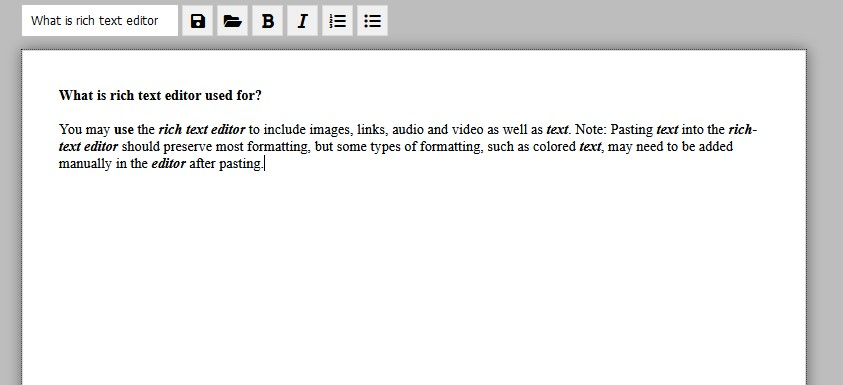

# Rich Text Editor

Simple WYSIWYG editor.

## How to start
To use app just open `src/index.html` in your favourite browser, 
or check it [LIVE](https://codepen.io/marcelmos/pen/vYxYaBw) on my Codepen.

### Saving/Opening File
App saving your documents in JSON file format, but to open file you can use `.txt` or `.json` format.

## About code
To allow user to save file without page reload I used:
> ``

This link allow me to use `saveAs()` function which is part of AJAX.

## Author
- Marcel Moś - Developer